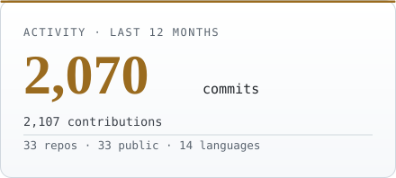
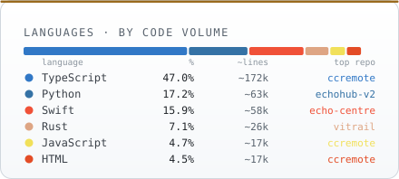
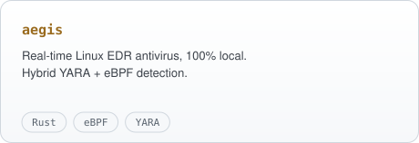
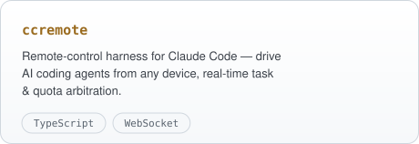
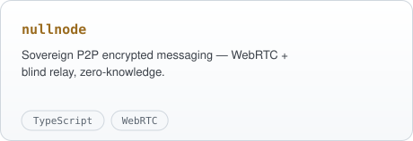
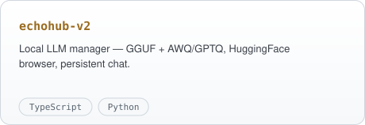
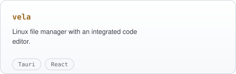
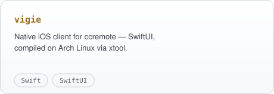

<!-- Christopher Couspeyre — profile README. Cards auto-générées (github-cards), dark + light. -->

  <picture>
    <source media="(prefers-color-scheme: dark)" srcset="./assets/banner-dark.svg"/>
    
  </picture>

<h3 align="center">Full-stack &amp; systems developer — I build local-first alternatives to costly proprietary software.</h3>

  Security · encrypted messaging · on-device AI · developer tooling — 
  20+ projects shipped solo, from Linux systems in <b>Rust</b> to desktop apps in <b>Tauri</b>.

 

  <a href="https://github.com/Chrlstopher-c?tab=repositories">
    <picture>
      <source media="(prefers-color-scheme: dark)" srcset="./assets/stats-dark.svg"/>
      
    </picture>
  </a>
  &nbsp;
  <a href="https://github.com/Chrlstopher-c?tab=repositories">
    <picture>
      <source media="(prefers-color-scheme: dark)" srcset="./assets/langs-dark.svg"/>
      
    </picture>
  </a>

  <a href="https://github.com/Chrlstopher-c">
    <picture>
      <source media="(prefers-color-scheme: dark)" srcset="https://raw.githubusercontent.com/Chrlstopher-c/Chrlstopher-c/output/github-snake-dark.svg"/>
      
    </picture>
  </a>

 

## Featured work

<table>
<tr>
<td width="50%">
  <a href="https://github.com/Chrlstopher-c/aegis"><picture><source media="(prefers-color-scheme: dark)" srcset="./assets/proj-aegis-dark.svg"/></picture></a>
</td>
<td width="50%">
  <a href="https://github.com/Chrlstopher-c/ccremote"><picture><source media="(prefers-color-scheme: dark)" srcset="./assets/proj-ccremote-dark.svg"/></picture></a>
</td>
</tr>
<tr>
<td width="50%">
  <a href="https://github.com/Chrlstopher-c/nullnode"><picture><source media="(prefers-color-scheme: dark)" srcset="./assets/proj-nullnode-dark.svg"/></picture></a>
</td>
<td width="50%">
  <a href="https://github.com/Chrlstopher-c/echohub-v2"><picture><source media="(prefers-color-scheme: dark)" srcset="./assets/proj-echohub-v2-dark.svg"/></picture></a>
</td>
</tr>
<tr>
<td width="50%">
  <a href="https://github.com/Chrlstopher-c/vela"><picture><source media="(prefers-color-scheme: dark)" srcset="./assets/proj-vela-dark.svg"/></picture></a>
</td>
<td width="50%">
  <a href="https://github.com/Chrlstopher-c/vigie"><picture><source media="(prefers-color-scheme: dark)" srcset="./assets/proj-vigie-dark.svg"/></picture></a>
</td>
</tr>
</table>

 

## Stack

`Rust` · `TypeScript` · `Python` · `Swift`  —  Tauri · React · Node.js · WebRTC · vLLM · eBPF · PipeWire · Cloudflare · SQLite / PostgreSQL / vector DBs

 

  <b><a href="https://christophercouspeyre.com">christophercouspeyre.com</a></b>  ·  Open to <b>remote</b> engineering roles  ·  📫 couspeyrechristopher.pro@gmail.com

