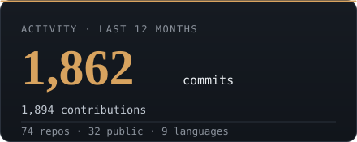
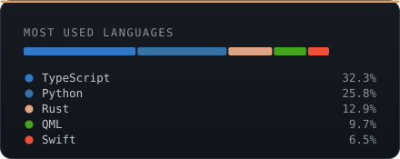
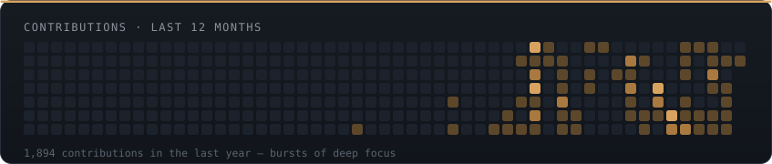

<!-- Christopher Couspeyre — profile README. Cards auto-générées (github-cards), rafraîchies chaque heure. -->

  

<h3 align="center">Full-stack &amp; systems developer — I build local-first alternatives to costly proprietary software.</h3>

  Security · encrypted messaging · on-device AI · developer tooling — 
  20+ projects shipped solo, from Linux systems in <b>Rust</b> to desktop apps in <b>Tauri</b>.

 

  
  &nbsp;
  

  

  

 

## Featured work

<table>
<tr>
<td width="50%" valign="top">

### 🛡️ Systems &amp; security
- **[aegis](https://github.com/Chrlstopher-c/aegis)** — real-time Linux EDR antivirus, 100% local. Hybrid YARA + eBPF.
- **[vitrail](https://github.com/Chrlstopher-c/vitrail)** — reversible network visibility: process attribution + cooperative TLS decryption + guaranteed kill-switch.
- **[nullnode](https://github.com/Chrlstopher-c/nullnode)** — sovereign P2P encrypted messaging (WebRTC + blind relay, zero-knowledge).

</td>
<td width="50%" valign="top">

### 🤖 AI &amp; tooling
- **[echohub](https://github.com/Chrlstopher-c/echohub)** — local LLM manager: GGUF + AWQ/GPTQ, HuggingFace browser, persistent chat.
- **[alto](https://github.com/Chrlstopher-c/alto)** — hands-free voice ↔ Claude Code: real-time STT/TTS, full-duplex echo guard, 6s→2s latency.
- **[vela](https://github.com/Chrlstopher-c/vela)** — Linux file manager with an integrated editor (Tauri v2 + CodeMirror).

</td>
</tr>
</table>

 

## Stack

`Rust` · `TypeScript` · `Python` · `Swift`  —  Tauri · React · Node.js · WebRTC · vLLM · eBPF · PipeWire · Cloudflare · SQLite / PostgreSQL / vector DBs

 

  <b><a href="https://christophercouspeyre.com">christophercouspeyre.com</a></b>  ·  Open to <b>remote</b> engineering roles  ·  📫 couspeyrechristopher.pro@gmail.com

<!-- profile README -->
